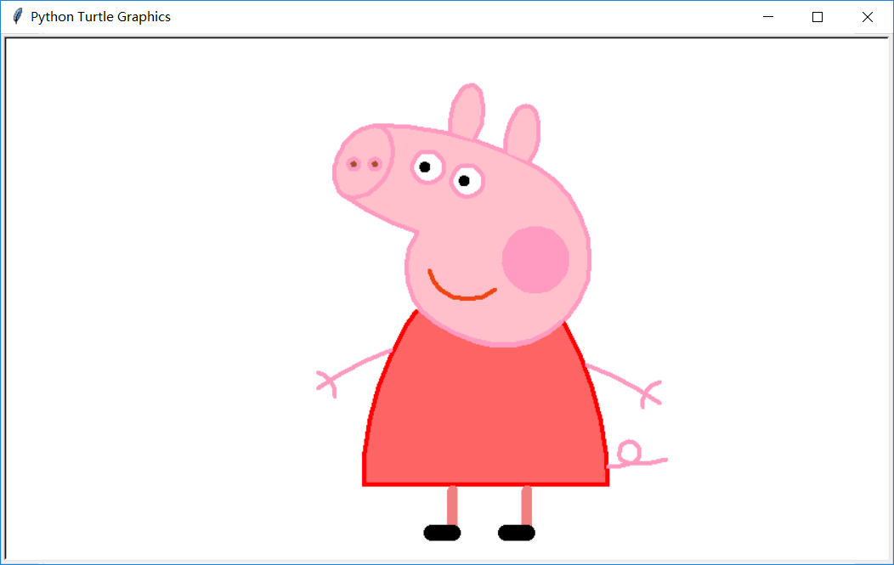

# 啥是佩奇

## [转] 本文代码转自公众号：恋习Python

效果图：

---  

基本思路：选好画板大小，设置好画笔颜色，粗细，定位好位置，依次画鼻子，头、耳朵，眼睛，腮，嘴，身体，手脚，尾巴，完事。
都知道，turtle 是 python 内置的一个比较有趣味的模块，俗称 海龟绘图，它是基于 tkinter 模块打造，提供一些简单的绘图工具。

在海龟作图中，我们可以编写指令让一个虚拟的（想象中的）海龟在屏幕上来回移动。这个海龟带着一只钢笔，我们可以让海龟无论移动到哪都使用这只钢笔来绘制线条。通过编写代码，以各种很酷的模式移动海龟，我们可以绘制出令人惊奇的图片。

使用海龟作图，我们不仅能够只用几行代码就创建出令人印象深刻的视觉效果，而且还可以跟随海龟看看每行代码如何影响到它的移动。这能够帮助我们理解代码的逻辑。所以海龟作图也常被用作新手学习 Python 的一种方式。更丰富详细的功能及知识可以参考：  
* （官方文档：https://docs.python.org/3/library/turtle.html）

了解了tuttle的用法之后就可以开始实战了。